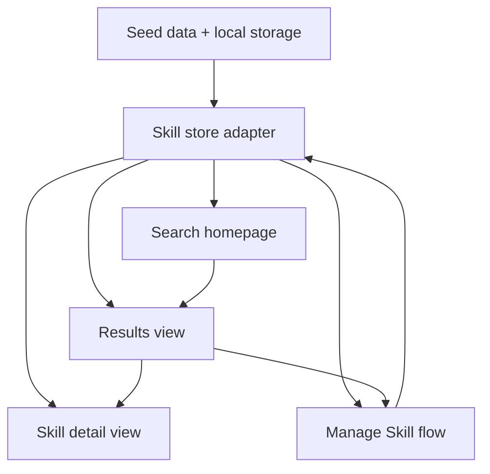

# AI Coding Skill Workflow Platform MVP Implementation Plan

## Summary

This plan replaces the repo's current blog-oriented shell with a focused single-user Skill workflow application built on the existing Umi + React + Ant Design stack. The implementation centers on four core views, a normalized front-end Skill card model, local persistence for manual maintenance, and search-first discovery flows that satisfy the MVP requirements without introducing a backend.

---

## Problem Frame

The origin requirements define a search-first Skill card product, but the current repo is only a thin Umi skeleton with stale blog routing and no reusable feature surfaces. The plan therefore needs to both establish the product shell and implement the actual MVP behavior in one coherent pass, while staying intentionally lightweight and avoiding backend or workflow automation scope creep.

---

## Requirements

- R1. Deliver a search-first homepage with secondary scenario entry, aligned to the origin homepage requirements (see origin: `docs/brainstorms/2026-05-25-ai-coding-skill-workflow-platform-mvp-requirements.md`).
- R2. Deliver a results view that supports rapid Skill judgment through visible card metadata and relevance cues.
- R3. Deliver a Skill detail view that exposes the full Skill information model, including lightweight history.
- R4. Deliver manual create and edit workflows for Skill cards with minimum required fields and simple history entry.
- R5. Keep the MVP single-user, front-end only, and free of online execution, team collaboration, or auto-import behavior.
- R6. Replace the broken legacy blog route structure with a product shell that matches the MVP flows and is maintainable within the current repo.

**Origin actors:** A1 (AI Coding developer), A2 (AI agent collaborator as a future secondary consumer)
**Origin flows:** F1 (find a Skill from a current problem), F2 (narrow by scenario), F3 (consume and reuse a Skill), F4 (add or update a Skill card manually)
**Origin acceptance examples:** AE1 (search-first discovery), AE2 (scenario narrowing), AE3 (detail consumption), AE4 (manual card creation)

---

## Scope Boundaries

### Deferred for later

- Automatic import or parsing of Skills from repositories, documents, or chat history
- AI agent auto-recommendation or automatic Skill invocation
- Structured recommendation ranking beyond simple client-side relevance rules
- Rich history state models such as approval, review workflow, or change diffs

### Outside this product's identity

- A generic development knowledge base
- A team collaboration and permissions platform
- An online Skill execution platform

### Deferred to Follow-Up Work

- Swapping local persistence for a shared API or database-backed store
- More sophisticated search analytics and result quality instrumentation
- Agent-readable export formats for direct machine consumption

---

## Context & Research

### Relevant Code and Patterns

- `.umirc.ts` already defines the Umi app shell, route configuration, and Ant Design theme wiring; this is the primary integration point for replacing the stale route map.
- `src/layouts/` exists and is the likely place to keep the outer application shell for shared navigation and page framing.
- The repo currently lacks `src/pages` and feature modules, so the plan should establish a simple feature-oriented structure rather than trying to preserve missing blog pages.

### Institutional Learnings

- `STRATEGY.md` anchors the product around "Skill card standardization + scenario-first retrieval support", with search-first entry and lightweight accumulation as non-negotiable product constraints.
- The origin requirements document makes the visible decision-support fields on Skill cards load-bearing, so the results page cannot collapse into a generic title list.

### External References

- Ant Design 4 component patterns are a fit for form-heavy CRUD, filter chips, cards, drawers, lists, and empty states without adding UI dependencies.
- Umi 3 route-based page structure is sufficient for this MVP; there is no technical need for additional routing or state frameworks unless implementation reveals one.

---

## Key Technical Decisions

- Use client-only persistence with `localStorage`: This keeps the MVP single-user and backend-free while still making create/edit behavior real instead of demo-only.
- Model Skills as normalized front-end entities: A stable TypeScript model for Skill cards, scenarios, history entries, and relevance metadata allows search, results, detail, and edit flows to share one source of truth.
- Replace the existing route map rather than layering on top of it: The current blog-oriented routes point to missing pages, so incremental reuse would add confusion rather than save effort.
- Keep search relevance simple and inspectable: Relevance should be derived from query text, trigger keywords, and scenario overlap so the UI can explain why a Skill matched without opaque ranking logic.
- Separate app shell from feature pages: A lightweight layout plus feature pages/modules keeps the MVP easy to extend without over-engineering state or service layers.

| Decision | Chosen approach | Why |
|---|---|---|
| Persistence | Browser `localStorage` plus seeded sample data | Real CRUD behavior without backend scope |
| Navigation model | Route-based 4-view app | Matches origin flows and current Umi strengths |
| Search behavior | Client-side filtering and simple scoring | Explains relevance and is enough for MVP-scale data |
| Editing surface | Dedicated manage page or drawer-backed form | Keeps maintenance reachable but secondary to discovery |

---

## Open Questions

### Resolved During Planning

- Should MVP use static seed data only or support real local edits? Local edits persisted in browser storage were chosen because they validate the maintenance workflow without introducing backend complexity.
- Should create/edit be a primary homepage action? No. Management remains clearly reachable but visually secondary to the discovery path.
- Should one Skill support multiple scenarios? Yes. The origin requirements make this explicit, so the data model and filters will treat scenarios as multi-valued.

### Deferred to Implementation

- Whether the manage flow feels better as a dedicated page with embedded form, a drawer from the list, or a hybrid page + modal trigger: the plan assumes one maintainable pattern will be selected during implementation once the shell exists.
- Exact empty-state and microcopy phrasing for search misses, zero-history cards, and first-run storage bootstrapping.

---

## Output Structure

```text
src/
  layouts/
    index.tsx
  pages/
    index.tsx
    results/
      index.tsx
    skills/
      [id].tsx
    manage/
      index.tsx
  components/
    app-shell/
      index.tsx
    search-hero/
      index.tsx
    scenario-entry/
      index.tsx
    skill-card/
      index.tsx
    skill-detail/
      index.tsx
    skill-form/
      index.tsx
    history-timeline/
      index.tsx
  features/
    skills/
      data.ts
      storage.ts
      search.ts
      selectors.ts
      types.ts
  utils/
    query.ts
```

---

## High-Level Technical Design

> *This illustrates the intended approach and is directional guidance for review, not implementation specification. The implementing agent should treat it as context, not code to reproduce.*



The browser boot sequence should load seeded Skills on first visit, hydrate any saved user-edited data from local storage, and expose one in-memory application source for all pages. Search and scenario selection should produce a shared query state shape that the results page can interpret into visible relevance reasons. Create/edit should write back through the same adapter so new or changed cards immediately affect discovery.

---

## Implementation Units

### U1. Rebuild the application shell and route map

**Goal:** Replace the stale blog shell with a coherent MVP route structure and shared page frame.

**Requirements:** R1, R5, R6

**Dependencies:** None

**Files:**
- Modify: `.umirc.ts`
- Modify: `src/layouts/index.tsx`
- Create: `src/pages/index.tsx`
- Create: `src/pages/results/index.tsx`
- Create: `src/pages/skills/[id].tsx`
- Create: `src/pages/manage/index.tsx`
- Test: `src/pages/__tests__/routing-shell.test.tsx`

**Approach:**
- Replace the current route table with the four core product views and remove references to missing blog pages.
- Build a shared shell that provides product title, top-level navigation, and room for search-first content rather than a content-blog layout.
- Keep the shell visually simple and intentionally product-oriented, with mobile-safe structure.

**Patterns to follow:**
- Existing Umi route and layout wiring in `.umirc.ts`
- Ant Design layout primitives already enabled in the project

**Test scenarios:**
- Happy path: Visiting `/` shows the homepage hero and primary search entry instead of a missing blog page.
- Happy path: Visiting `/results`, `/skills/:id`, and `/manage` renders the correct frame and does not break top-level navigation.
- Edge case: Navigating to an unknown route lands in a defined fallback or safe default instead of a broken blank state.
- Integration: Navigation between home, results, detail, and manage preserves a coherent app shell.

**Verification:**
- The app boots into the new product shell and no route points at removed or missing blog pages.

---

### U2. Introduce the Skill domain model, seeded data, and local persistence adapter

**Goal:** Establish the front-end data foundation for Skills, scenarios, history entries, and search metadata.

**Requirements:** R2, R3, R4, R5

**Dependencies:** U1

**Files:**
- Create: `src/features/skills/types.ts`
- Create: `src/features/skills/data.ts`
- Create: `src/features/skills/storage.ts`
- Create: `src/features/skills/selectors.ts`
- Create: `src/utils/query.ts`
- Test: `src/features/skills/__tests__/storage.test.ts`
- Test: `src/features/skills/__tests__/selectors.test.ts`

**Approach:**
- Define a single `Skill` entity shape that includes card fields, scenario membership, required inputs, source reference, expected output, and history.
- Seed the app with a realistic starter dataset so search and detail experiences are meaningful from first run.
- Wrap browser storage access behind a small adapter that can load, seed, save, and reset data without leaking storage concerns into pages.

**Technical design:** *(optional -- directional only)*
- Model scenarios as reusable value objects or keyed labels rather than duplicating raw strings everywhere.
- Keep history entries simple: timestamp, summary, optional note, and optional outcome marker if the UI benefits from it.

**Patterns to follow:**
- Lightweight front-end module boundaries under `src/features/`
- Existing TypeScript project setup in `package.json` and `tsconfig.json`

**Test scenarios:**
- Happy path: First run with empty storage hydrates seeded Skill data.
- Happy path: Saving a created or edited Skill persists and is visible after reload.
- Edge case: Corrupt or missing storage payload falls back safely to seed data.
- Edge case: A Skill with multiple scenarios remains queryable by each scenario label.
- Integration: Selector helpers return stable lists for home, results, and detail consumers without page-level data reshaping.

**Verification:**
- Pages can consume one stable domain model and browser reload does not discard user-created edits.

---

### U3. Build the search-first homepage and scenario-assisted results flow

**Goal:** Implement the primary discovery path from natural-language input or scenario entry into a relevance-rich results view.

**Requirements:** R1, R2, R3, R5

**Dependencies:** U1, U2

**Files:**
- Modify: `src/pages/index.tsx`
- Create: `src/pages/results/index.tsx`
- Create: `src/components/search-hero/index.tsx`
- Create: `src/components/scenario-entry/index.tsx`
- Create: `src/components/skill-card/index.tsx`
- Create: `src/features/skills/search.ts`
- Test: `src/pages/__tests__/search-flow.test.tsx`
- Test: `src/features/skills/__tests__/search.test.ts`

**Approach:**
- Make the homepage lead with one prominent free-form input and support shortcut scenario chips or cards beneath it.
- Route both entry modes into a results page that can interpret query text, scenario filters, or both.
- Build result cards around fast judgment fields rather than long descriptions.
- Expose simple match reasons so the user sees why a Skill is appearing.

**Execution note:** Keep the first implementation client-side and deterministic so result behavior is easy to inspect and tune.

**Patterns to follow:**
- Ant Design form, input, tag, card, empty-state, and list components
- Search-first orientation from `STRATEGY.md` and the origin requirements

**Test scenarios:**
- Happy path: Entering a free-form query from the homepage lands on the results page with relevant cards.
- Happy path: Selecting a scenario entry from the homepage lands on a narrowed results set.
- Edge case: Query plus scenario can coexist without breaking the result set.
- Edge case: No-match query shows an empty state that still offers recovery actions.
- Error path: Missing optional card fields such as empty recent history do not break result rendering.
- Integration: Each result card shows Skill name, one-line purpose, applicable scenarios, trigger conditions or keywords, input requirements, and recent history summary.

**Verification:**
- A user can start from either free text or scenario and reach a scannable result set that explains relevance.

---

### U4. Build the Skill detail experience and history presentation

**Goal:** Turn each Skill into a consumable detail page that supports confident reuse.

**Requirements:** R2, R3

**Dependencies:** U2, U3

**Files:**
- Create: `src/pages/skills/[id].tsx`
- Create: `src/components/skill-detail/index.tsx`
- Create: `src/components/history-timeline/index.tsx`
- Test: `src/pages/__tests__/skill-detail.test.tsx`

**Approach:**
- Render one complete Skill information model with clear sections for problem solved, use timing, scenarios, triggers, inputs, usage method, expected output, and source reference.
- Surface history as a lightweight, readable timeline or note list rather than an admin audit view.
- Provide a direct path from detail to edit so the user can maintain the Skill once they spot something stale.

**Patterns to follow:**
- Ant Design descriptions, typography, timeline or list primitives
- Data contracts established in U2

**Test scenarios:**
- Happy path: Opening a valid Skill detail page shows the full required information model.
- Happy path: A Skill with multiple history entries renders them in readable order.
- Edge case: A Skill with no history still renders a helpful empty state instead of a broken timeline.
- Error path: Navigating to a missing Skill id yields a safe not-found or recoverable state.
- Integration: Source path or link is visible and usable from the detail page.

**Verification:**
- The detail page answers "what is this, when do I use it, and how was it used before?" without returning to raw project documents.

---

### U5. Implement manual create/edit management and save-back behavior

**Goal:** Support real MVP maintenance workflows for creating, editing, and extending Skill cards.

**Requirements:** R4, R5

**Dependencies:** U2, U3, U4

**Files:**
- Create: `src/pages/manage/index.tsx`
- Create: `src/components/skill-form/index.tsx`
- Modify: `src/features/skills/storage.ts`
- Modify: `src/features/skills/selectors.ts`
- Test: `src/pages/__tests__/manage-skill.test.tsx`

**Approach:**
- Provide a form-based management surface with the required fields from the origin requirements.
- Support both creating a new Skill and editing an existing one using the same data model and validation rules.
- Allow the user to append a lightweight history note during edits without inventing a larger workflow.
- Save all changes back through the local persistence adapter and refresh downstream discovery immediately.

**Patterns to follow:**
- Ant Design form validation, textarea, tag-like multi-value entry, and button actions
- Storage and selector abstractions from U2

**Test scenarios:**
- Happy path: Creating a new Skill with required fields saves successfully and becomes searchable.
- Happy path: Editing an existing Skill updates its visible result card and detail page after save.
- Edge case: Required-field validation prevents incomplete save attempts.
- Edge case: Adding a simple history note during edit appends to the Skill without corrupting prior notes.
- Integration: A newly created multi-scenario Skill appears under each associated scenario on the results page.

**Verification:**
- The MVP supports end-to-end manual curation without backend services or hidden data loss.

---

### U6. Polish discovery quality, responsiveness, and test coverage for MVP readiness

**Goal:** Close the loop on usability, consistency, and verification across the full MVP.

**Requirements:** R1, R2, R3, R4, R5, R6

**Dependencies:** U1, U2, U3, U4, U5

**Files:**
- Modify: `src/pages/index.tsx`
- Modify: `src/pages/results/index.tsx`
- Modify: `src/pages/skills/[id].tsx`
- Modify: `src/pages/manage/index.tsx`
- Modify: `src/layouts/index.tsx`
- Test: `src/pages/__tests__/mvp-smoke.test.tsx`

**Approach:**
- Make the main flows coherent on desktop and mobile widths.
- Ensure empty states, first-run seeded data states, and not-found states feel intentional.
- Add a thin end-to-end smoke layer at component/page level so regressions across discovery, detail, and manage flows surface quickly.

**Execution note:** Prefer behavior-focused tests over style snapshots.

**Patterns to follow:**
- Existing project responsive layout conventions where any survive after shell rebuild
- Ant Design empty-state and layout responsiveness patterns

**Test scenarios:**
- Happy path: Seeded first-run experience allows a user to search, open detail, and edit data in one session.
- Edge case: Browser refresh after editing preserves saved data and still allows search and detail access.
- Edge case: Mobile-width layout keeps primary input, card content, and form actions usable.
- Integration: The full homepage -> results -> detail -> edit -> results loop works without manual data resets.

**Verification:**
- The MVP feels coherent as a real single-user tool rather than a disconnected UI demo.

---

## System-Wide Impact

- **Interaction graph:** Homepage query state, results filtering, detail selection, and manage save actions all depend on the shared Skill store adapter and should not diverge into page-local data copies.
- **Error propagation:** Invalid route ids, empty query results, and storage corruption should fail into recoverable UI states rather than blank screens.
- **State lifecycle risks:** Mixing seeded data with persisted edits can create duplicate or stale Skill records if bootstrapping rules are not explicit.
- **API surface parity:** Because the MVP has no backend, every behavior surface depends on the same front-end domain model; data contract drift across components would be user-visible immediately.
- **Integration coverage:** Unit tests alone will not prove the full discovery-to-edit loop, so at least one smoke scenario must cover search, detail, mutation, and persistence together.
- **Unchanged invariants:** The MVP must not introduce online execution, remote storage, collaboration roles, or opaque recommendation logic while replacing the blog shell.

---

## Risks & Dependencies

| Risk | Mitigation |
|------|------------|
| Route replacement accidentally leaves the app in a broken boot state because existing pages are missing | Make route rebuild the first implementation unit and verify navigation before feature work |
| Local persistence shape drifts from seeded data shape and causes runtime failures | Centralize types and storage hydration logic in one adapter with corruption fallback behavior |
| Search results feel arbitrary or unhelpful | Keep scoring simple, visible, and grounded in card fields the UI can explain |
| Manual edit UX becomes heavier than the rest of the MVP | Limit required fields to the origin minimum set and keep history entry simple text |
| Current repo has too little reusable UI structure, leading to ad hoc page code | Establish a small component and feature folder structure early so later units reuse the same boundaries |

---

## Documentation / Operational Notes

- Update `README.md` after implementation so it reflects the Skill workflow product instead of the old blog.
- Seed data should include enough realistic Skills to exercise multi-scenario matching, history rendering, and edit flows.
- If the implementation adds local storage keys, document the key names and reset behavior in developer-facing notes or README updates.

---

## Sources & References

- **Origin document:** [docs/brainstorms/2026-05-25-ai-coding-skill-workflow-platform-mvp-requirements.md](docs/brainstorms/2026-05-25-ai-coding-skill-workflow-platform-mvp-requirements.md)
- Strategy: [STRATEGY.md](STRATEGY.md)
- Umi config: [.umirc.ts](.umirc.ts)
- Existing shell anchor: [src/layouts/index.tsx](src/layouts/index.tsx)
